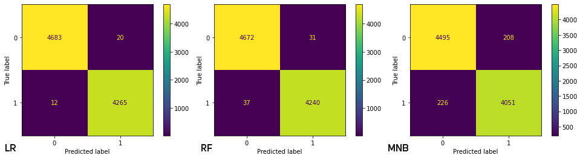
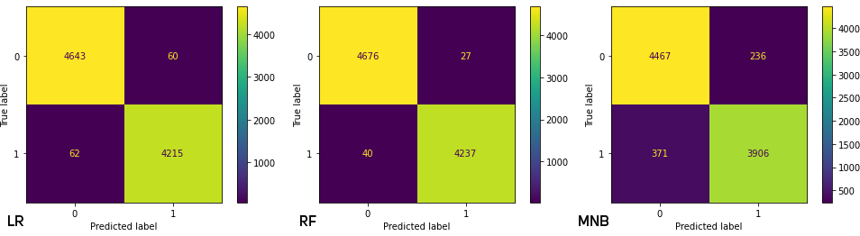

# FAI(TH): Falsified Narrative Verification through Machine Learning Ensemble Methods for Text and Web-Based Inputs (Text and Hyperlinks)
**A reaserach project for CAPSTONE**

The Internet had become an integral part of the electronic media, mainly in terms of disseminating information to the public. As internet consumption is growing over the past years, the circulation of news online has also been rapidly increasing. Along with this, disinformation or fake news rapidly grows and spreads throughout the internet narrowing the differences between fake and real.

## Objective:
The main objective of this project is to provide a tool that could assess and distinguish falsified information with the use of machine learning. In addition to this, the researchers would like to broaden the capability of machine learning and its efficiency in achieving the following:
1. Accurate detection whether an internet article is legitimate or not based on specific attributes.
2. The algorithm is able to process aggregated information in determination of the validity of an article.
3. Effectiveness of the models used in specification of article legitimacy.
4. Ability of the model to prevent misinformation by accurate identification whether falsified or factual statements.
5. Efficiency of machine learning-based model in verifying text-based and web-based inputs using language-centered verification algorithms and classification techniques. 

**Techinal tools used:**

Jupyter Notebook, Python, Scikit, Numpy, Pandas, Nltk, Re, Newspaper3k, and Matplotlib

**Dataset(s)**

ISOT Fake News Dataset: https://www.uvic.ca/ecs/ece/isot/datasets/fake-news/index.php

Two csvs that I have used to implement the system are:

“Fake1.csv”: Contains Fake News Dataset - no of records : 23481

“True1.csv”: Contains Real News Dataset - no of records : 21417

Total records of 44898 entries for the dataset.

**Necessary Links**

++Under development

# Results and Graphs
Confusion Matrix for CountVectorizer Pipeline

Confusion Matrix for TF-IDF Vectorizer Pipeline

